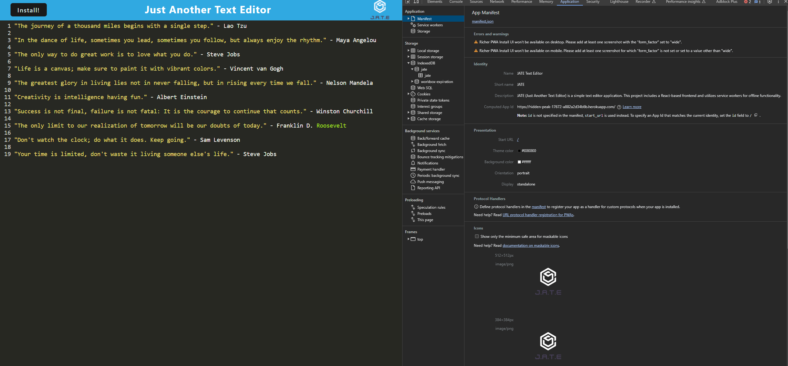

# Text Editor

## Description
JATE (Just Another Text Editor) is a simple text editor application. This project includes a React-based frontend and utilizes service workers for offline functionality.

## Table of Contents
- [Installation](#installation)
- [Usage](#usage)
- [License](#license)
- [Contributing](#contributing)
- [Tests](#tests)
- [Questions](#questions)

## Installation
To run JATE locally, follow these steps:

1. Clone this repository to your local machine.

2. Install the required dependencies:  
In bash: npm install  

## Usage
Follow these steps for usage:

1. After running npm install, you've already installed the dependencies for both the server and client. These dependencies include Express, if-env, concurrently, and nodemon for development.  You can now enter one of the following commands in the command line/bash.

Development Mode:
To run the app in development mode, you can use the following command:

bash: npm run start:dev
This command uses concurrently to run the server and client concurrently in development mode.

Production Build:
If you want to build the production version of the client and start the server, you can use:

bash: npm start
This command runs the npm run build script for the client to create a production build, and then it starts the server using node server.js.

Server Only (Development):
If you want to run only the server in development mode (with nodemon for automatic server restarts), you can use:

bash: npm run server

Client Only (Development):
If you want to run only the client in development mode, you can use:

bash: npm run client

Build Client Only (Production):
If you want to build only the client for production, you can use:

bash: npm run build
This will create a production-ready build of your client application.

2. Visit http://localhost:3000 in your browser to use the text editor or visit the Heroku link 

Here is my Heroku link for the application:

https://hidden-peak-17672-a882a2d34b6b.herokuapp.com/

## License

## License

MIT License

## Contributing
None

## Tests
None

## Questions
For additional questions, contact .
GitHub: [SacredSoulrend](https://github.com/SacredSoulrend)

## Resources
Tutor: Jacob Carver